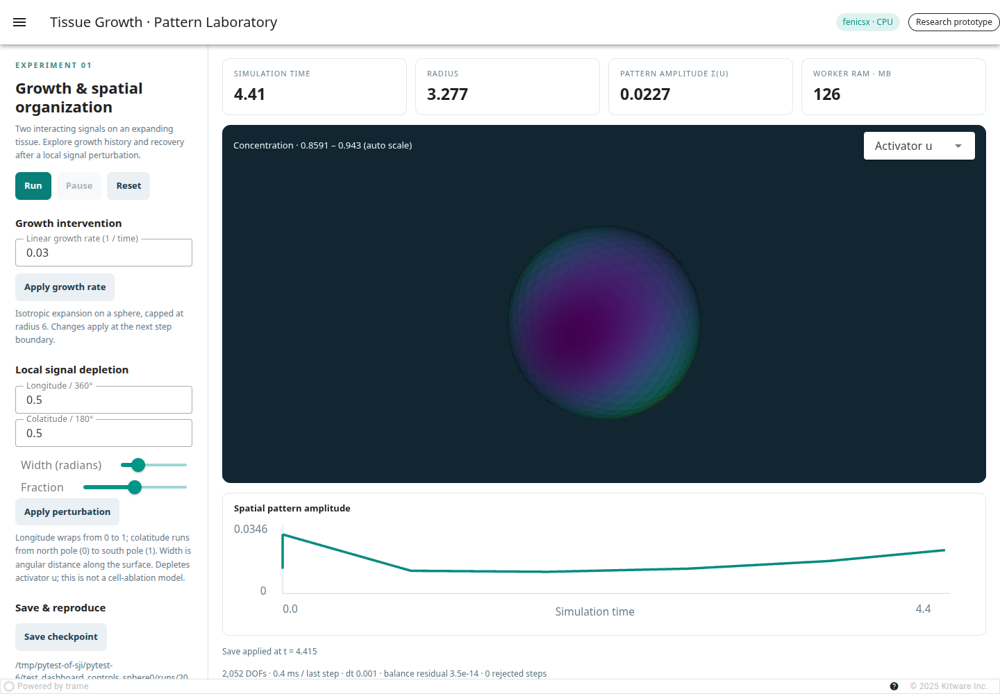
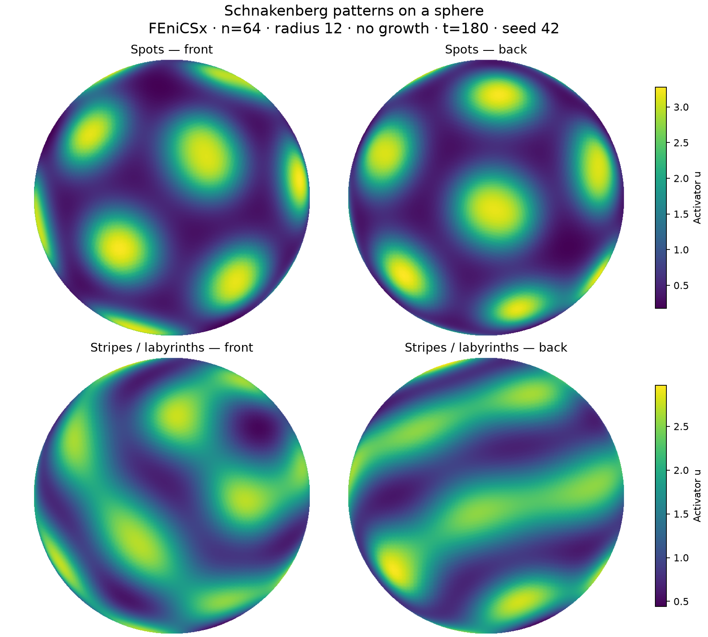

# Tissue Growth · Pattern Laboratory

[](https://github.com/jiyunmaths/tissue-growth/actions/workflows/ci.yml)
[](LICENSE)

A runnable Python prototype for **growth-dependent pattern formation**, the first computational stage of the development–repair–cancer project.

This repository is an actively developing research prototype. Simulation outputs under `runs/` are generated locally and intentionally excluded from version control; use the supplied configurations and validation documentation to reproduce them.

It combines a **FEniCSx/PETSc finite-element solver**, a **PyVista/trame browser dashboard**, a separate simulation process, reproducible parameter files, intervention logs, checkpoint restart, and CPU benchmarks. An explicitly selected SciPy finite-element reference backend is included for independent checks and installations without FEniCSx.

**Scientific scope:** the pattern laboratory simulates two abstract signaling species on an isotropically growing **spherical surface in 3D**, with the original square retained as an alternative. Concentrations and diffusion live on the two-dimensional surface; the sphere's interior is not discretized. The spatial Aim 1 model couples renewing and differentiated populations to niche activity and a mobile precursor, supporting renewing-rich niches and bands on a fixed surface. A three-field homogeneous control is also retained. These models do not yet simulate mutations, force balance, clonal competition, or cancer. All quantities are dimensionless.



Start the growing sphere in an installed environment:

```bash
tissue-growth dashboard --config configs/sphere.json
```

The sphere starts at radius 3 and expands to radius 6. Rotate it with the mouse to inspect both hemispheres. Add `--backend scipy` to explicitly use the reference backend. Installation instructions are below.

## Aim 1: establish and repair normal organization

Open the interactive Aim 1 simulation with:

```bash
tissue-growth aim1-dashboard --config configs/aim1_niches.json --initial near_uniform
```

Visit `http://127.0.0.1:8080` and press **Run**. The spatial model establishes renewing-rich niches surrounded by differentiated-rich tissue on a fixed unit sphere. **Renewing-cell fraction** shows the architecture; total cell density may be much smoother. Choose **bands** in the **Spatial preset** menu and press **Reset** to explore connected bands, or launch with `--config configs/aim1_bands.json`. Each preset uses the same feedback rules and differs only in precursor supply. Start near uniform, random, low, high, mosaic, or lineage-segregated to examine establishment without installing a target pattern.

Allow the structure to develop and settle (reference protocol: time 300), then apply a local perturbation and continue running to watch repair. **Also deplete niche signals** removes local signal and precursor as well as cells; uncheck it for cell-only injury. The cards and trace show mean density, lineage contrast, and proliferation flux. Cumulative proliferation and cell loss remain visible when density is stable. **Save snapshot** writes all four fields, parameters, and intervention history. Snapshots are for analysis; the pattern laboratory's `--restart` does not load them. Each run saves diagnostics and provenance under `runs/`.

Local niche activation consumes a faster-diffusing precursor. Niche activity promotes renewal and suppresses differentiation, differentiated cells suppress niche activity, and crowding regulates cell number. No equation contains a target map or an error relative to a prescribed pattern. Equations, parameters, thresholds, and limitations are in [SPATIAL_AIM1.md](docs/SPATIAL_AIM1.md).

Each spatial preset has a separate evidence protocol: five initial conditions at two seeds, a turnover interval, and three lesions with and without signal depletion. Parameters are held fixed across the experiments within each preset:

```bash
tissue-growth aim1 --config configs/aim1_niches.json --output runs/niches-evidence.json
tissue-growth aim1 --config configs/aim1_bands.json --output runs/bands-evidence.json
```

The spatial protocol requires persistent lineage contrast, distinct renewing-rich and differentiated-rich regions, ongoing turnover, and repair relative to an uninjured time-matched trajectory. It reports connected-component counts and field mismatch without forcing restoration at prescribed coordinates. Passing these screens does not establish a unique spot count, band topology, a minimal mechanism, or a tissue-specific anatomical model.


The earlier three-field model remains available through `configs/aim1_normal.json` as a **homogeneous population-control baseline**. Its flat-state criteria and [reference report](docs/aim1-reference.json) do not test the revised spatial aim. Its equations are retained in [AIM1.md](docs/AIM1.md).

## Simulation methods

The methods below describe the implemented model in [solver.py](src/tissue_growth/solver.py), the spatial operators in [operators.py](src/tissue_growth/operators.py), and the parameters in [config.py](src/tissue_growth/config.py). Simulations evolve dimensionless activator and inhibitor concentrations, denoted by $u$ and $v$, on a prescribed growing two-dimensional tissue. Growth does not depend on either concentration.

### Geometry, transport, and boundary conditions

Set `geometry="sphere"` for $\Gamma(t)=\{\mathbf{x}\in\mathbb{R}^3:|\mathbf{x}|=L(t)\}$, where `length` and `max_length` denote initial and maximum **radius**. Set `geometry="square"` for $\Omega(t)=[0,L(t)]^2$, where these parameters denote side length. Configurations and old checkpoints without a `geometry` key retain the square interpretation. Before reaching the size cap, the linear size obeys $\dot L=gL$, where $g\geq0$ is the relative linear growth rate. For constant $g$,

$$
L(t)=\min\{L_0\exp(gt),L_{\max}\}.
$$

Growth-rate interventions make $g$ piecewise constant; setting it to zero pauses expansion. Once the cap is reached, the domain remains fixed. The tissue velocity is $\mathbf{w}(\mathbf{x},t)=(\dot L/L)\mathbf{x}$. On the sphere, surface concentrations satisfy the material conservation equation

$$
\partial_t^\bullet c_i+c_i\nabla_\Gamma\cdot\mathbf{w}
=D_i\Delta_\Gamma c_i+R_i(u,v),
\qquad \nabla_\Gamma\cdot\mathbf{w}=2\dot L/L.
$$

Here $\partial_t^\bullet$ follows a material surface point and $\Delta_\Gamma$ is the Laplace–Beltrami operator (diffusion tangent to the surface). The sphere is closed, with no boundary conditions or flux into the interior. On the square, the equivalent Eulerian equation is

$$
\partial_t c_i+\nabla_{\mathbf{x}}\cdot(c_i\mathbf{w})
=D_i\Delta_{\mathbf{x}}c_i+R_i(u,v),
\qquad c_i\in\{u,v\}.
$$

For the square, zero normal diffusive flux, $\nabla_{\mathbf{x}}c_i\cdot\mathbf{n}=0$, is imposed on all four moving boundaries. There is no exchange through the boundary relative to the tissue.

Calculations use material coordinates $\mathbf{y}=\mathbf{x}/L(t)$ on a fixed unit sphere or unit square. The transformed equation is

$$
\left.\partial_t c_i\right|_{\mathbf{y}}
=\frac{D_i}{L(t)^2}\Delta_{\mathbf{y}}c_i+R_i(u,v)
-2\frac{\dot L}{L}c_i.
$$

Here $\Delta_{\mathbf{y}}$ means the unit-sphere surface Laplacian for spherical runs. The last term accounts for dilution by increasing **area**. The factor of two follows from the two-dimensional tissue, including when embedded in 3D. This coordinate transformation represents uniform isotropic growth without remeshing. The spherical surface itself is approximated with planar triangles as described below.

### Reaction kinetics and initial conditions

Local production and consumption follow the Schnakenberg system:

$$
R_u=\rho(a-u+u^2v),\qquad
R_v=\rho(b-u^2v),
$$

where $\rho$ is `reaction_scale`. Setting $\rho=0$ disables both reactions. For positive $\rho$, the spatially uniform, nongrowing equilibrium is

$$
u_*=a+b,\qquad v_*=\frac{b}{(a+b)^2}.
$$

Both fields start with the same relative spatial perturbation:

$$
u(\mathbf{y},0)=u_*[1+\epsilon\eta(\mathbf{y})],\qquad
v(\mathbf{y},0)=v_*[1+\epsilon\eta(\mathbf{y})],
$$

For the square,

$$
\eta(\mathbf{y})=\frac{1}{12}\sum_{r=1}^{12}A_r
\cos(\pi k_{r,1}y_1)\cos(\pi k_{r,2}y_2).
$$

Here $\epsilon$ is `noise`. For the square, NumPy's `default_rng(seed)` draws two integer mode indices from 1 through 8, then one amplitude uniformly from $[-1,1)$, for each of the 12 terms. Modes may repeat.

For the sphere, initialization instead uses a smooth field with no longitude seam or pole singularity:

$$
\eta(\mathbf{y})=\frac{1}{12}\sum_{r=1}^{12}A_r
\cos(\pi k_r\mathbf{d}_r\cdot\mathbf{y}+\psi_r).
$$

For each term, the same seeded generator draws three independent standard normal values and normalizes them to obtain $\mathbf{d}_r$, then draws $k_r$ from integers 1 through 8, $\psi_r$ uniformly from $[0,2\pi)$, and $A_r$ uniformly from $[-1,1)$. These are ambient cosine waves restricted to the sphere, not individual spherical harmonics.

Both constructions bound $|\eta|\leq1$ and give positive initial concentrations for the allowed $0\leq\epsilon<1$. Fields are evaluated at reference mesh nodes, so degree-of-freedom ordering does not affect initialization. This is a seeded cosine perturbation, not spatial white noise or stochastic forcing during the run. The nongrowing equilibrium is an initial reference state; dilution generally drives the homogeneous concentrations away from it during growth.

### Spatial discretization and linear solves

For a sphere, each octahedron edge is divided into `n` segments, each of its eight faces is triangulated, and vertices are projected radially onto the unit sphere. Shared edges and poles use the same vertices, producing a closed surface with outward-oriented faces, $8n^2$ triangles, $4n^2+2$ nodes per field, and $8n^2+4$ scalar unknowns. The mesh has flat triangular faces; geometric error decreases with refinement. Both backends use the same spherical triangulation.

For a square, `n` subdivisions along each axis give two right triangles per grid square, $2n^2$ triangles, $(n+1)^2$ nodes per field, and $2(n+1)^2$ scalar unknowns. Continuous piecewise-linear (P1 Lagrange) finite elements represent each species in both geometries. Connectivity and reference coordinates remain fixed; physical node positions are $L(t)\mathbf{y}$. Thus physical mesh spacing increases as the tissue grows.

For nodal basis functions $\phi_j$, the reference stiffness and diagonal lumped mass are

$$
K_{jk}=\int_{\widehat\Omega}\nabla\phi_j\cdot\nabla\phi_k\,d\mathbf{y},
\qquad (M_\ell)_{jj}=m_j=\int_{\widehat\Omega}\phi_j\,d\mathbf{y}.
$$

For the sphere these integrals run over the triangulated reference surface, using tangential gradients and surface area measure. The weights $m_j$ are the row sums of the consistent mass matrix; each triangle contributes one third of its area to each vertex. The square's zero-flux condition is natural in the weak formulation. Both operators are assembled once on the reference mesh. DOLFINx uses triangular cells with three-dimensional coordinates through its [mesh creation API](https://docs.fenicsproject.org/dolfinx/v0.10.0/python/generated/dolfinx.mesh.html#dolfinx.mesh.create_mesh); SciPy independently computes tangential basis gradients from triangle normals in 3D.

The intended backend assembles these operators with DOLFINx and solves each species separately with PETSc. The base configuration uses conjugate gradients (CG) with Jacobi preconditioning; `pc="gamg"` selects algebraic multigrid. CG uses the previous solution as its initial guess, relative tolerance `1e-10`, absolute tolerance `1e-14`, and at most 10,000 iterations. The current matrix is always updated when its diffusion multiplier changes. Multigrid setup is reused while that multiplier remains within a factor 1.25 of its setup value, then rebuilt. This reuses a preconditioner, not an outdated system matrix.

The sphere presets select `pc="auto"`: use CG/multigrid while the diffusion multiplier changes, switch to a cached sparse LU factorization on a repeated multiplier, and switch back to CG/multigrid when it changes again. Thus fixed-domain segments can reuse a factorization without iterative solves. LU generally requires more memory than iterative methods. PETSc options with prefixes `tissue_0_` and `tissue_1_` can customize settings; automatic mode controls the solver/preconditioner types and initial-guess mode itself, so use an explicit `pc` for manual control of those choices. [PETSc documents preconditioner reuse here](https://petsc.org/release/manualpages/KSP/KSPSetReusePreconditioner/).

The explicitly selected SciPy backend independently assembles the triangular elements and uses SciPy CG with relative tolerance `ksp_rtol`, zero absolute tolerance, its library-default iteration limit, and Jacobi preconditioning, regardless of `pc`. For the square, the backends may choose opposite triangle diagonals and different boundary mass weights, so identical finite-resolution trajectories are not required. Each backend caches a matrix per species. A failed linear solve stops the simulation.

### Conservative time integration and step acceptance

Define the area Jacobian $J=L^2$ and the concentration scaled by area, $q_i=Jc_i$. Its reference-domain equation is

$$
\partial_t q_i=\frac{D_i}{L^2}\Delta_{\mathbf{y}}q_i+J R_i(q_u/J,q_v/J).
$$

At accepted time level $s$, a trial step starts with $h=\min(\mathtt{dt},t_{\mathrm{end}}-t_s)$, or the remaining interval to an explicitly requested earlier stopping time. The algorithm computes

$$
L_{s+1}=L_s\exp\!\left[\min\!\left(gh,\log\frac{L_{\max}}{L_s}\right)\right],
\qquad J_{s+1}=L_{s+1}^2,
$$

$$
\left(M_\ell+h\frac{D_i}{J_{s+1}}K\right)q_i^{s+1}
=M_\ell\left[q_i^s+hJ_sR_i(u^s,v^s)\right],
\qquad c_i^{s+1}=\frac{q_i^{s+1}}{J_{s+1}}.
$$

Reactions are evaluated explicitly at the old concentrations, including the nonlinear term at nodes; diffusion is implicit and uses the new domain size. This is a **first-order time integration scheme**. The capped exponential gives the exact growth endpoint for a piecewise-constant rate; a step crossing the cap is not split at the cap time.

A trial is rejected if its reaction-updated $q$ is nonfinite or negative, or if the solved concentrations are nonfinite or below `-1e-12`. Rejection halves $h$ and retries from the unchanged old state, recomputing the growth endpoint. Failure occurs if the halved step falls below `min_dt`. Accepted concentrations are never clipped: tiny negative values within the stated tolerance are retained. Each new step starts again from the configured `dt`, limited by the remaining simulation interval. This rejection procedure enforces admissibility, **not an estimate of time integration error**.

With reactions disabled and no depletion, the discrete physical amount $\mathbf{1}^{T}M_\ell q_i$ is conserved to linear-solver tolerance. A uniform passive field therefore follows $c_i(t)=c_i(0)L_0^2/L(t)^2$. These conservation properties do not imply that a nonuniform reacting solution is temporally resolved.

### Parameters and supplied experiments

JSON files override the defaults in `Config`; omitted keys retain those defaults. The recommended surface experiment, `configs/sphere.json`, uses `geometry="sphere"`, `pc="auto"`, `n=64` (32,772 unknowns), radius 3 growing to a cap of 6, `growth_rate=0.02`, `dt=0.02`, `t_end=180`, `noise=0.1`, `seed=42`, and snapshots every 5 time units. Its remaining parameters match the shared defaults below. Without interventions, it reaches the radius cap at approximately time 34.66. The existing square configurations remain available:

| Quantity (configuration key) | Baseline `default.json` | `quick_demo.json` | `passive_growth.json` |
|---|---:|---:|---:|
| Subdivisions per side (`n`) | 48 | 40 | 16 |
| Total scalar unknowns | 4,802 | 3,362 | 578 |
| Nominal time step (`dt`) | 0.02 | 0.02 | 0.05 |
| Final time (`t_end`) | 160 | 80 | 5 |
| Initial side length (`length`) | 3 | 6 | 3 |
| Maximum side length (`max_length`) | 12 | 12 | 6 |
| Relative linear growth rate (`growth_rate`) | 0.015 | 0.02 | 0.1 |
| Reaction multiplier (`reaction_scale`) | 1 | 1 | 0 |
| Initial perturbation scale (`noise`) | 0.01 | 0.1 | 0 |
| Random seed (`seed`) | 42 | 42 | 42 |
| Snapshot interval (`snapshot_every`) | 2 | 5 | 2 |

All three use `backend="fenicsx"`, $a=0.1$, $b=0.9$, $D_u=1$, $D_v=20$, `min_dt=1e-7`, `ksp_rtol=1e-10`, `pc="jacobi"`, and `diagnostic_every=0.5`. The passive example initializes uniformly at $(u,v)=(1,0.9)$ and isolates area dilution; its size cap is not reached by time 5. Without interventions, the baseline and quick demonstration reach their caps at $\log(L_{\max}/L_0)/g$, approximately 92.42 and 34.66, respectively. All simulation parameters, coordinates, and times are dimensionless; they have not been calibrated to biological units.

### Resolving and obtaining spots or stripes

The sphere example now uses `n=64`, compared with the original `n=24`:

| Mesh | Triangles | Vertices per species | Total unknowns |
|---|---:|---:|---:|
| Original (`n=24`) | 4,608 | 2,306 | 4,612 |
| Current (`n=64`) | 32,768 | 16,386 | 32,772 |

This is a real refinement of the finite-element mesh, with about 7.1 times as many unknowns and shorter edges. At radius 6, the longest mesh edge is approximately 0.230; it doubles at radius 12. It increases computation, rendering, and checkpoint costs. Start a **new dashboard process** to load a changed JSON file; Reset reuses the configuration loaded when the process started. Restarting an old checkpoint restores its old mesh. The simulation does not remesh a checkpoint.

Mesh refinement resolves a pattern; it does not make a stable homogeneous state unstable or select stripes instead of spots. Two additional configurations provide controlled pattern experiments:

| Configuration | Intended morphology | `a` | `b` | Radius | Growth rate |
|---|---|---:|---:|---:|---:|
| `configs/sphere_spots.json` | Spots | 0.025 | 1.24 | 12 | 0 |
| `configs/sphere_stripes.json` | Stripes / labyrinths | 0.025 | 1.55 | 12 | 0 |

Both use `pc="auto"`, `du=1`, `dv=20`, `reaction_scale=1`, `n=64`, `noise=0.1`, `seed=42`, `dt=0.02`, and `t_end=180`. The reaction parameter choices come from the isotropic Schnakenberg examples in [Staddon (2024), *Physical Review E*](https://doi.org/10.1103/PhysRevE.110.034402). The spherical domain and seeded initial condition here differ from that paper. The preset names identify their intended morphology; exact spot counts, stripe arrangement, and robustness across seeds require numerical checks.

Both presets were originally run with FEniCSx/Jacobi through time 180 at the stated resolution, before enabling the faster automatic solver. Each completed 9,000 steps without rejection. The spot case produced distinct activator peaks; the stripe case produced connected bands with some spot-like defects, rather than perfectly parallel stripes. The following front/back projections show the computed final activator fields, interpolated only for display. Each row has its own concentration scale. This is one seed and one discretization, not a morphology convergence study.



```bash
tissue-growth dashboard --config configs/sphere_spots.json
tissue-growth dashboard --config configs/sphere_stripes.json
```

Run one dashboard command at a time, or specify a different `--port`. Use the Linux graphics workaround above if needed. These presets hold radius fixed to isolate reaction–diffusion pattern selection and use a larger sphere so multiple wavelengths fit. They do not change the growing experiment in `sphere.json`. To study growth afterward, copy a preset, set initial and maximum radius separately, and choose a positive growth rate; a rate change cannot expand a sphere already at its configured cap.

For a mathematical check, let $s=a+b$. At the nongrowing homogeneous equilibrium, the reaction Jacobian is

$$
F=\rho\begin{pmatrix}(b-a)/s&s^2\\-2b/s&-s^2\end{pmatrix}.
$$

A Turing instability requires a stable homogeneous mode (all eigenvalues of $F$ have negative real parts) and a growing nonuniform mode. On a sphere of radius $L$, test

$$
\lambda_\ell=\max\operatorname{Re}\operatorname{eig}
\left[F-\frac{\ell(\ell+1)}{L^2}\operatorname{diag}(D_u,D_v)\right],
\qquad \ell=1,2,\ldots.
$$

At least one $\lambda_\ell$ must be positive. For the spots preset at radius 12, the unstable degrees are 4–10; for stripes, they are 5–9. The fastest degrees are 6 and 7, with growth rates about 0.261 and 0.108, respectively. These predictions are calculated from the continuum equations, not fitted to the simulation. They predict initial amplification, not final morphology. The original growing sphere at its final radius 6 admits degrees 2–4 under the nongrowing equilibrium approximation, so relatively few broad features are expected even on a very fine mesh.

For a convincing pattern experiment:

1. Keep a small nonzero `noise` to seed symmetry breaking. A perfectly uniform deterministic initial state has no deliberately seeded spatial modes.
2. Allow time for amplification and nonlinear saturation. Stripes in this parameter choice grow more slowly than spots. Early color contrast can just be the initial perturbation or an imposed depletion.
3. Begin without growth or manual depletion, then introduce them in separate comparisons. Growth changes the wavelengths, dilutes both species, and shifts the homogeneous state; the fixed-equilibrium calculation above is not a growth-phase prediction.
4. Follow `std_u` and the actual concentration range, and inspect the whole sphere. The automatically rescaled color map can exaggerate tiny fluctuations; spatial standard deviation alone cannot distinguish stripes from spots.
5. Check smaller time steps (e.g. `--dt 0.01`), finer meshes (e.g. `--n 96`), and several seeds before claiming a robust morphology. Diffusion is implicit but reactions are explicit; accepted positive steps do not certify temporal accuracy. Compare morphology and wavelength statistics rather than expecting pixel-identical patterns across seeds.

### Local depletion and growth interventions

An activator depletion applied at simulation time $t_p$ changes nodal values instantaneously according to

$$
u(\mathbf{y},t_p^+)=u(\mathbf{y},t_p^-)
\left[1-f\exp\!\left(-\frac{d(\mathbf{y},\mathbf{y}_p)^2}{2r^2}\right)\right].
$$

On the sphere, the input `x` is longitude divided by $2\pi$ and `y` is colatitude divided by $\pi$, both in $[0,1]$. The center is $\mathbf{y}_p=(\sin(\pi y)\cos(2\pi x),\sin(\pi y)\sin(2\pi x),\cos(\pi y))$, and $d=\arccos(\operatorname{clip}(\mathbf{y}\cdot\mathbf{y}_p,-1,1))$ is great-circle angular distance. Width `radius` is in radians; physical arc width is $L(t_p)r$. Longitudes 0 and 1 coincide; colatitudes 0 and 1 are the north and south poles. This avoids a seam and keeps depletion localized to the chosen hemisphere. On the square, the center is $(x,y)$ in reference coordinates and $d$ is Euclidean distance.

The inhibitor and domain size are unchanged by this operation. The Gaussian width satisfies $0<r\leq1$ and the depletion fraction satisfies $0\leq f\leq1$. At the center, the multiplier is $1-f$; the profile has no sharp cutoff. The solver method defaults to `(x,y)=(0.5,0.5)`, width 0.12, and fraction 0.5. On the sphere this center is on the negative x-axis. Events record these parameters, the application time, and the removed physical activator amount; interpret their coordinates using the run's `geometry`. Growth interventions record the old and new rates and retain the configured size cap. Dashboard commands are applied at numerical step boundaries. Neither intervention occurs automatically in the supplied batch configurations.

### Measurements, recording, and reproducibility

For nodal concentrations $c_{i,j}$, diagnostics use the same lumped-mass weights as the solver:

$$
\bar c_i=\frac{\sum_jm_jc_{i,j}}{\sum_jm_j},\qquad
\sigma_u=\sqrt{\frac{\sum_jm_j(u_j-\bar u)^2}{\sum_jm_j}},\qquad
A_i=L^2\sum_jm_jc_{i,j}.
$$

Here $A_i$ is physical species amount and $\sigma_u$ is the reported activator spatial standard deviation (`std_u`). These are lumped nodal quadrature measurements. The reported tissue `area` is $L^2\sum_jm_j$: exactly $L^2$ on the square and the triangulated area approaching $4\pi L^2$ on the sphere. `length` records sphere radius or square side length. CSV diagnostics also report nodal minima, time, accepted and rejected step counts, the last accepted step size, summed linear iterations for both species on the accepted trial, timings, and memory usage.

For each accepted step, let $B_i=\sum_jm_j[q_{i,j}^s+hJ_sR_{i,j}(c^s)]$. The recorded `balance_error` is

$$
\frac{\max_i|A_i^{s+1}-B_i|}{\max(\max_i|B_i|,10^{-15})}.
$$

It measures agreement with the discrete reaction-source balance, not error against the continuum solution, and excludes depletion between steps. Output intervals are checked after accepted steps: records are written at the first eligible step, and the next interval is measured from that recorded time. Output times are not enforced by shortening steps. Initial and final records are forced, as are selected dashboard actions.

For a reproducible comparison, retain the resolved configuration and software provenance in `run.json`, the intervention history, diagnostics, and checkpoints described below. Report any solver-option overrides separately. Use matched seeds and explicitly specified intervention times when comparing growth or depletion conditions, and assess sensitivity to initial perturbations with additional seeds. The seeded initial condition does not by itself establish robustness across initial conditions.

Spatial variation is the measured pattern amplitude; it is not a wavelength estimate, recovery metric, or proof of a Turing instability. Before reporting onset times, wavelengths, or recovery outcomes, define the measurement criterion and check it under smaller `dt` and larger `n`, including resolution at the largest physical size. The validation suite below checks conservation, reaction dynamics, diffusion convergence, and restart behavior; it does not replace convergence studies for a particular experiment. Further model context is in [docs/MODEL.md](docs/MODEL.md).

## Start on your MacBook

Install a native Apple Silicon conda distribution such as Miniforge, then open Terminal in this extracted project directory:

```bash
conda env create -f environment.yml
conda activate tissue-growth
tissue-growth dashboard --config configs/sphere.json
```

Open **http://127.0.0.1:8080** in your browser. Press **Run**. No cloud account or hosted service is needed. Keep the terminal running; stop the application with Ctrl+C.

The environment targets **DOLFINx 0.10.x, Python 3.12, and trame 3.x**. It deliberately does not follow unpinned development APIs. On macOS, the first compiled form may require Apple's command-line compiler tools (`xcode-select --install`). This environment must be resolved for your own platform; Linux validation does not constitute a Mac installation test.

On the current Linux workstation, VTK's native graphics context failed. The dashboard was verified using the installed Xvfb virtual display and software rendering:

```bash
LIBGL_ALWAYS_SOFTWARE=1 VTK_DEFAULT_OPENGL_WINDOW=vtkXOpenGLRenderWindow \
  xvfb-run -a tissue-growth dashboard --config configs/sphere.json
```

This workaround is specific to Linux graphics setup; it does not change the numerical backend. The browser still displays and rotates the surface locally.

The sphere demonstration starts at radius 3. The original square quick demonstration (`configs/quick_demo.json`) starts at side length 6. The square baseline starts at side length 3:

```bash
tissue-growth dashboard --config configs/default.json
```

Changes to `geometry`, `n`, diffusivities, kinetic parameters, initial length, growth cap, and final time belong in the JSON configuration or a new run. `--geometry sphere` or `--geometry square` can override geometry when starting a new run. In-run growth interventions and localized signal depletion are available in the dashboard.

### Explicit reference-backend installation

If you want to inspect the interface before installing FEniCSx:

```bash
python3 -m venv .venv
source .venv/bin/activate
python -m pip install -e '.[test]'
tissue-growth dashboard --config configs/sphere.json --backend scipy
```

This runs an independently assembled P1 finite-element implementation with SciPy CG. **It is labeled `scipy` in the interface and never substitutes silently for FEniCSx.** The reference backend uses Jacobi preconditioning regardless of the PETSc `pc` configuration. Use FEniCSx for the intended project workflow.

## Browser controls

- **Run / Pause:** advance or pause the worker at a numerical step boundary.
- **Reset:** save and close the previous worker; start a new run from the startup configuration. Reset does not retain unsaved slider choices or in-run interventions.
- **Apply growth rate:** change the relative *linear* growth rate. In 2D, relative area growth is twice the linear growth rate. Zero pauses growth; negative rates are rejected. The configured size cap remains active.
- **Apply perturbation:** multiply activator `u` by a Gaussian depletion profile. On the sphere, set normalized longitude and colatitude and a width in radians. On the square, use normalized material coordinates and width relative to side length.
- **Save checkpoint:** write `checkpoint.npz` in the displayed run directory on the server machine.
- **Field selector:** switch between activator `u` and inhibitor `v`.

Rotate/zoom/pan the tissue with the mouse. The initial camera is set using the maximum configured domain extent, so expansion changes the displayed tissue size. The color map automatically rescales and its numerical range is displayed above the view: **color alone is not evidence of growing pattern amplitude**. Read the spatial standard deviation chart and CSV diagnostics. The live chart is limited to the latest 500 displayed samples; the on-disk diagnostic record is separate.

The GUI refreshes at up to about four field snapshots per wall-clock second. Numerical time steps are independent of this display rate. One pending frame is retained, preventing an unbounded visualization backlog. GUI failure or loss of a browser connection does not change the numerical equations; the server remains responsible for its worker.

This is a **single-user application**. Browser tabs connected to one server share one experiment. It binds to localhost by default; no authentication or multiuser job management is implemented.

## Batch runs and restart

```bash
tissue-growth run --config configs/sphere.json --output runs/sphere

tissue-growth run --config configs/default.json --output runs/baseline

tissue-growth run --config configs/passive_growth.json --output runs/passive

tissue-growth dashboard --restart runs/baseline/state_00001000.npz

tissue-growth run --restart runs/baseline/state_00001000.npz --output runs/restarted
```

The output directory for a batch run must not already exist. `--restart` restores the checkpoint configuration and interventions and cannot be combined with configuration overrides. A checkpoint at the final time is complete: resume from an earlier saved snapshot if you want to intervene before the end. Increasing the final time of a completed run is not implemented in this version.

Each run includes:

| File | Contents |
|---|---|
| `run.json` | Configuration, package versions, platform, creation time |
| `diagnostics.csv` | Means, spatial amplitude, physical amounts, step timings, solver iterations, balance residual, memory |
| `events.json` | Applied interventions and controls with simulation times |
| `state_XXXXXXXX.npz` | Periodic full states, indexed by accepted step number |
| `checkpoint.npz` | Explicitly saved, completed, or gracefully closed state |
| `summary.json` | Diagnostics at graceful closure or batch completion |

A checkpoint contains concentrations, reference coordinates, triangulation, time, size, current growth rate, and intervention history. No pickled Python objects are used. Restart reconstructs the mesh and remaps coordinates to allow changes in local degree-of-freedom ordering, while rejecting a changed triangulation. Use the same backend and compatible package versions on the second machine. Cross-architecture floating-point trajectories need not be bitwise identical.

Only checkpoints are written by an atomic temporary-file replacement. A forced process termination or power loss can lose changes after the most recent snapshot. Normal shutdown tries to save before exiting; an unresponsive worker is terminated after a timeout.

## Run on the desktop; view from the MacBook

Install the same project and compatible environment on the desktop. For Windows, a Linux environment such as WSL2 is the intended deployment route. Start the dashboard there on localhost. From your MacBook, connect to that machine's SSH server:

```bash
ssh -N -L 8080:127.0.0.1:8080 your_user@your_desktop
```

Open the same local browser address on your MacBook. Full states stay on the desktop; display geometry and fields reach the browser. Stop the old job, copy a checkpoint, and restart to transfer work between machines. Live process migration is not implemented.

**Version 0.1 uses CPU computation and one MPI rank per worker.** Do not launch it with `mpirun`. Two NVIDIA GPUs are not automatically used. The 64 GB desktop can still help with memory and CPU throughput. MPI domain decomposition, remote image rendering, GPU matrices, and distributed checkpoints are future extensions that need their own benchmarks.

## Export a state to ParaView

```bash
python examples/export_checkpoint.py runs/baseline/checkpoint.npz field.vtu
```

The exported mesh is in physical coordinates with both concentration fields.

## Benchmark on your hardware

```bash
tissue-growth benchmark --backend fenicsx --sizes 32 64 128 --steps 100 --output benchmark.json
```

The command above benchmarks the square, with `2*(n+1)^2` scalar unknowns. Square meshes with `n=64,224,499` correspond to approximately 8,450, 101,250, and 500,000 unknowns; start with the smaller default sizes. For the sphere, add `--geometry sphere`; it has `8*n^2+4` scalar unknowns (32,772 at `n=64`), so use smaller `n` for comparable cost. The benchmark reports initial setup, warm steps, current process RSS, and lifetime process peak RSS. Sizes are run sequentially within one process, so the peak is a process high-water mark, not an isolated per-size maximum. It excludes dashboard rendering and disk snapshots. Run a representative batch job as well to measure output costs.

For small sparse problems, excessive BLAS threading can hurt performance. Compare the benchmark with `OPENBLAS_NUM_THREADS=1 OMP_NUM_THREADS=1` set before the command, especially for the SciPy reference backend. Memory information is reported as unavailable if the OS denies access; it does not stop a simulation.

The base configuration retains Jacobi as a small-problem baseline, while all sphere presets now use `"pc": "auto"`. Compare `--pc auto`, `--pc gamg`, and `--pc jacobi` on your hardware. Automatic mode is useful when a fine mesh spends substantial time at fixed size; for much larger meshes, use `gamg` if LU's extra memory becomes limiting. No GPU speedup or MacBook runtime is promised.

### Accelerating the fine sphere

The optimized FEniCSx backend reuses previous solutions and multigrid setup, then caches a direct factorization when the diffusion matrix stops changing. The sphere configurations enable it with `pc="auto"`. Start a new dashboard process to load the updated configuration; an old checkpoint retains its saved `pc` choice.

Use one BLAS/OpenMP thread for this serial sparse workload, and retain the Linux graphics workaround if needed:

```bash
OPENBLAS_NUM_THREADS=1 OMP_NUM_THREADS=1 \
LIBGL_ALWAYS_SOFTWARE=1 VTK_DEFAULT_OPENGL_WINDOW=vtkXOpenGLRenderWindow \
  xvfb-run -a tissue-growth dashboard --config configs/sphere.json
```

On the validation workstation, the following 200-step warm benchmarks used `n=64`, `dt=0.02`, unchanged tolerances, and one BLAS/OpenMP thread. They include Python profiling overhead and exclude rendering and output:

| Segment | Original Jacobi | Optimized automatic mode | Speedup |
|---|---:|---:|---:|
| Growing from radius 3 | 25.3 ms/step | 15.7 ms/step | 1.6× |
| Fixed radius 6 | 15.0 ms/step | 4.35 ms/step | 3.5× |

The first solver setup is excluded; the automatic fixed-domain measurement includes the subsequent LU setup. Initial assembly and changes between strategies still cost time. The mesh, equations, time step, and iterative tolerances were not relaxed. Automatic-mode concentrations differed from the original Jacobi runs by less than `6e-9` after these short comparisons. See [docs/VALIDATION.md](docs/VALIDATION.md) for full-run checks and limits.

For the full growing sphere through time 180, solver compute time decreased from **154 to 53 seconds (2.9× faster)** on the same workstation. The optimized batch loop including recording took about 55 seconds. Both runs accepted 9,000 steps without rejection, and the maximum final concentration difference was about `2.02e-7`. This is a measured improvement for this example, not a promised speedup on every mesh or computer.

For maximum throughput, use `tissue-growth run --config configs/sphere.json` to avoid browser rendering. Increasing `snapshot_every` reduces disk compression and writes when output is a bottleneck. If speed matters more than resolution during exploration, `--n 48` reduces the sphere to 18,436 unknowns, but verify results again at `n=64`. Increasing `dt` changes temporal accuracy and should only follow a time-step convergence check. GPU computation and multi-rank MPI remain unimplemented; additional cores or GPUs are not automatically used.

## Validation

```bash
python -m pytest -q
```

The tests cover passive-growth amount conservation, area dilution, a homogeneous reaction ODE comparison, spatial convergence of a known Neumann diffusion eigenmode, checkpoint/intervention restart, rejected reaction steps, invalid input, and the worker control protocol. Surface tests also check closed mesh topology and orientation, area convergence to $4\pi$, decay of the degree-one spherical harmonic, great-circle depletion and longitude periodicity, sphere restart, legacy square checkpoints, and agreement between backends. FEniCSx tests run when that package is installed; the reference suite still runs without it.

Optional real-browser test:

```bash
python -m playwright install chromium
TISSUE_BROWSER_TEST=1 TISSUE_TEST_BACKEND=fenicsx python -m pytest -q -m browser
```

See `docs/VALIDATION.md` for what was actually executed in the development environment and its limitations. Numerical acceptance checks are not temporal error estimation: refine `dt` and `n` before reporting a transition threshold, selected wavelength, or recovery time.

## Project map

- `config.py`: validated immutable startup configuration.
- `geometry.py`: deterministic square and closed spherical reference meshes.
- `operators.py`: FEniCSx/PETSc and SciPy diffusion operators.
- `solver.py`: growth, reactions, conservative stepping, interventions, diagnostics, restart.
- `recording.py`: run provenance, CSV records, periodic checkpoints.
- `worker.py`: separate process and bounded display queue.
- `dashboard.py`: browser application and PyVista field rendering.
- `organization.py`: homogeneous Aim 1 population-control baseline.
- `spatial_organization.py`, `spatial_protocol.py`: spatial niches/bands model and establishment/repair evidence.
- `organization_live.py`: recorded browser trajectories for both Aim 1 models.
- `cli.py`: dashboard, batch runs, and benchmarks.
- `configs/`: Aim 1 common-normal protocol, growing sphere, fixed-radius spot and stripe controls, square baseline, square quick demonstration, and passive-growth examples.
- `tests/`: numerical, process-control, and browser checks.

Read `docs/MODEL.md` before changing the equations. Aim 1's first biological extension is documented in [docs/AIM1.md](docs/AIM1.md); it is intentionally isolated from the original two-species pattern solver until its common-parameter evidence is established.
