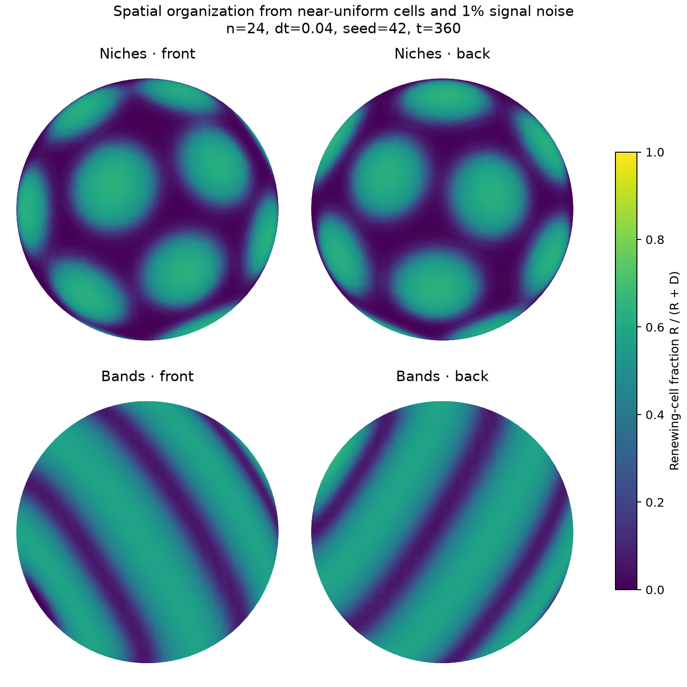

# Spatial Aim 1: renewing-cell niches and connected bands

The revised candidate normal state has persistent renewing-rich regions surrounded by differentiated-rich tissue. The three-field homogeneous model is retained as a population-homeostasis control; its flat-state tests are not evidence for this spatial aim.

## Local mechanism

Four dimensionless fields evolve on a fixed unit sphere: renewing cells $R$, differentiated cells $D$, niche activity $N$, and a mobile niche precursor $S$. Niche activity catalyzes its own production by consuming precursor. Faster precursor diffusion supplies competition between neighboring active regions. This is an activator–substrate mechanism, an abstract mathematical candidate rather than an identified molecular pathway. Pattern selection into spots and stripes is well established for this class of reaction–diffusion systems ([Shoji et al., 2003](https://pubmed.ncbi.nlm.nih.gov/12941592/)); coupling that mechanism to cell renewal is a modeling hypothesis here.

Set $C=R+D$, $H=N^4/(h^4+N^4)$, and $H_e=1-w_N+w_NH$. The local fluxes are

$$
P=\beta(0.2+0.8H_e)R\max(0,1-w_MC/K),\qquad
F=\kappa(1-0.98H_e)R,\qquad
E=\eta w_M\max(0,C-K).
$$

High niche activity promotes renewal and reduces differentiation. Low niche activity favors differentiation. Differentiated cells suppress niche activity, and local crowding limits population growth. The field equations are

$$
\partial_tR=D_R\Delta_\Gamma R+P-F-\mu_RR-E R/C,
$$
$$
\partial_tD=D_D\Delta_\Gamma D+F-\mu_DD-E D/C,
$$
$$
\partial_tN=D_N\Delta_\Gamma N+a+\chi N^2S-N-\gamma DN,
$$
$$
\partial_tS=D_S\Delta_\Gamma S+b-\chi N^2S.
$$

Extrusion fractions are zero when $C=0$. Differentiation transfers cells between compartments, so it cancels from the total population source. Both cell-loss terms remain active during steady organization. No reaction term contains coordinates, an initial field, a target pattern, or an error relative to a stored map. The closed sphere supplies no imposed organizing boundary. The precursor is consumed, not an inhibitor secreted by cells; its depletion provides competition.

## Parameters and morphology presets

| Parameter | Niches | Bands |
|---|---:|---:|
| Precursor supply $b$ | 1.24 | 1.65 |
| Basal niche production $a$ | 0.025 | 0.025 |
| Activation $\chi$ | 1 | 1 |
| Signal diffusion $D_N,D_S$ | 1/144, 20/144 | same |
| Cell diffusion $D_R,D_D$ | 0.0002, 0.003 | same |
| Renewal $\beta$ | 2.4 | 2.4 |
| Differentiation $\kappa$ | 0.5 | 0.5 |
| Turnover $\mu_R,\mu_D$ | 0.03, 0.08 | same |
| Differentiated feedback $\gamma$ | 0.1 | 0.1 |
| Half-response $h$ | 1.2 | 1.2 |
| Crowding $K,\eta$ | 1, 2 | same |
| Feedback weights $w_N,w_M$ | 1, 1 | same |

The two presets are distinct normal morphology hypotheses. Each uses one unchanged parameterization across all its initial conditions and lesions. They are not separate fits for different perturbations. Preset names describe representative observed morphology; exact spot counts, band topology, orientation, and placement can depend on initial noise and numerical resolution. The legacy `niche_recovery` parameter is inherited for configuration compatibility but is unused in these spatial equations.

## Establishment, persistence, and repair

`near_uniform` starts with 1% density/signal noise and a renewing fraction near 0.36. Signal levels are initially spatially constant plus noise. They evolve freely afterward. Low-density, overcrowded, mosaic, and lineage-segregated starts vary cell populations independently of these initial signal fluctuations. The optional imposed-pattern start is explicitly a maintenance exploration and is excluded from establishment evidence.

The spatial protocol uses five starts at seeds 42 and 43, each evolving to time 300 and then through a 60-unit turnover interval. Cell and signal parameters are unchanged. Acceptance requires nonuniform lineage composition at both times, population drift below 3%, contrast drift below 15%, and positive integrated proliferation, differentiation, and differentiated-cell loss. Across starts, late mean population must agree within 10%. Near-uniform starts must amplify lineage contrast at least tenfold.

“Organized” in this first spatial protocol means standard deviation of renewing fraction above 0.08, more than 3% of the surface renewing-rich ($R/C>0.4$), more than 3% differentiated-rich ($R/C<0.2$), and mean occupancy between 0.1 and 1.1. These are structural screening criteria; they do not prove tissue-specific anatomy or a unique attractor.

One established reference is branched into an uninjured sham and six repair trajectories: three `(angular width, central depletion)` pairs `(0.20,0.40)`, `(0.35,0.60)`, `(0.50,0.90)`, each with either cell depletion alone or depletion of all four fields. The latter reduces local signaling memory as well as cells. These finite Gaussian lesions retain residual signal and surrounding tissue; complete cue erasure is not tested. Branches evolve for 180 units with identical parameters. Recovery requires organization, mean population within 10% of the time-matched sham, lineage contrast within 25%, and mean differentiated fraction within 0.1. Direct cell-field mismatch is reported separately; it is not used to force an exact positional match. Branch times and cumulative fluxes restart at zero, while field values come from the established state.

Two descriptive mechanism controls remove local activation or disconnect niche signaling from cell fate. They are not rescue parameterizations and are excluded from the normal pass/fail result. These controls address pattern generation and cell response. They do not yet establish a minimal sufficient rule set or fully test H1's mechanical contribution to spatial repair.

## Reference evidence

Both full protocols passed their structural acceptance criteria. Reports are [niches](aim1-niches-reference.json) and [bands](aim1-bands-reference.json). Runtime was approximately 269 and 268 seconds respectively in the development environment, with concurrent work on the host; these are not controlled performance comparisons.

| Result across ten establishment runs | Niches | Bands |
|---|---:|---:|
| Late mean occupancy range | 0.6246–0.6267 | 0.8039–0.8179 |
| Late SD of renewing fraction | 0.2325–0.2358 | 0.1672–0.1892 |
| Renewing-rich connected components | 17–18 | 4–11 |
| Maximum repair population error vs sham | 0.065% | 0.015% |
| Maximum repair contrast error vs sham | 0.057% | 0.083% |

The representative near-uniform seed-42 run has isolated niches in the first preset and connected bands in the second, as shown below. Some band-preset initial conditions yield more fragmented structures; the current structural acceptance criteria do not guarantee connected bands for every start. Topological robustness remains an open requirement.



In the seed-42 near-uniform turnover interval, niches accumulated proliferation 2.2831 and differentiated loss 1.8489; bands accumulated 2.8137 and 2.1868. Removing local activation reduced late lineage contrast below 0.00003, while disconnecting niche from cell fate reduced it to numerical zero. These controls show that a colored signal field alone is insufficient for cellular organization.

## Numerical method and commands

The mesh, lumped P1 surface operators, and explicit-reaction/implicit-diffusion method are shared with the original model. The spatial preset uses `n=24`, `dt=0.04`. Because mesh, radius, and diffusion are fixed, each diffusion matrix is factored once with sparse LU and reused. A changed trial step replaces its factorization. Invalid trial states cause step halving without clipping or accumulating rejected fluxes. A test compares the mass-weighted update with the independently calculated reaction balance. Another checks that the positive homogeneous reaction equilibrium is stable without diffusion but has growing finite-wavelength modes after diffusion is included.

Run either evidence suite with:

```bash
tissue-growth aim1 --config configs/aim1_niches.json --output runs/niches-evidence.json
tissue-growth aim1 --config configs/aim1_bands.json --output runs/bands-evidence.json
```

Render the reference cell-composition maps with `python tools/render_spatial.py`. The front/back views use the same color range, with interpolation only for display. Further mesh/time convergence, additional seeds, lesion locations, recovery times, and quantitative topology tests are needed before claiming robust normal anatomical repair.

## Browser exploration

```bash
tissue-growth aim1-dashboard --config configs/aim1_niches.json --initial near_uniform
```

Press Run, and view **Renewing-cell fraction** to see lineage architecture. Total density can be relatively smooth while lineage composition is patterned. The **Spatial preset** menu switches between niches and bands when Reset is pressed; custom retains the loaded parameterization. Changing a preset starts a new recorded run, rather than retuning a repair experiment in progress. The default lesion also depletes niche signals; uncheck that option to compare cell-only repair. The trace shows lineage contrast, which should rise and persist, rather than being scored by how close it gets to zero.
